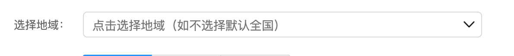
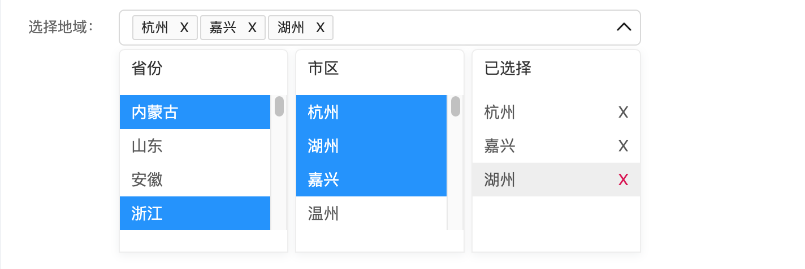

# Secondary-linkage-UI-component

react-UI 组件

---

#### 二级联动菜单

初始图：  

选择中：  

选择后：  


/\* props 参数：

###### data

---

传一个二维数组

###### firstLevelTitle

---

省份文字修改 默认显示省份

###### secondaryTitle

---

市区文字修改 默认显示市区

###### threeLevelTitle

---

已选文字修改 默认显示已选择

###### placeholderText

---

input 框里的提示信息 不传默认如上图

```js
<DropDown
  data={cityArr}
  firstLevelTitle="省份"
  secondaryTitle="市区"
  threeLevelTitle="已选择"
  placeholderText="点击选择地域（如不选择默认全国）"
/>
```
